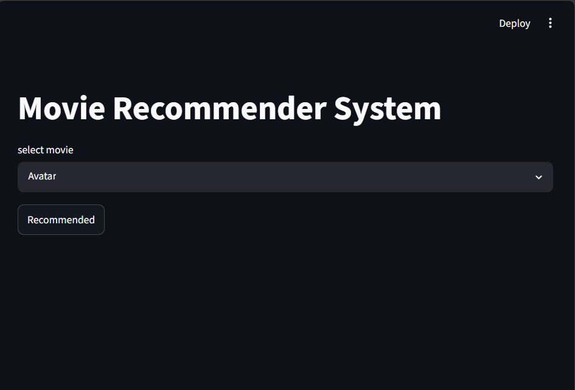
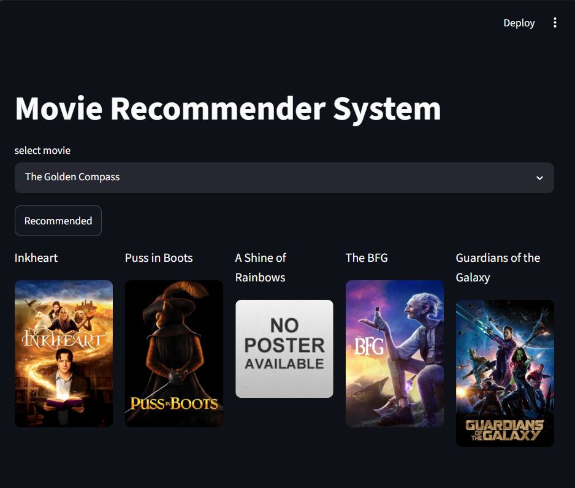

# 🎬 Movie Recommender System

A Content-Based Movie Recommendation System built using Python, NLP, Scikit-Learn, and Streamlit.

The system recommends movies similar to a selected movie by analyzing genres, keywords, cast, crew, and plot descriptions using Natural Language Processing techniques and Cosine Similarity.

---

## 🚀 Features

- Content-Based Movie Recommendations
- TMDB Poster Integration
- Interactive Streamlit Web Application
- NLP-Based Feature Engineering
- Cosine Similarity Recommendation Engine
- Fast Recommendation Generation

---

## 🛠️ Tech Stack

### Programming Language
- Python

### Libraries & Frameworks
- Pandas
- NumPy
- NLTK
- Scikit-Learn
- Streamlit
- Requests

### Machine Learning Techniques
- Text Vectorization (CountVectorizer)
- Natural Language Processing (NLP)
- Cosine Similarity

---

## 📂 Project Structure

```text
Movie-Recommender-System/
│
├── app.py
├── requirements.txt
├── README.md
├── .gitignore
├── movie_dict.pkl
├── similarity.pkl
├── Movie recommender system.ipynb
├── tmdb_5000_movies.csv
└── tmdb_5000_credits.csv
---

## ⚙️ How It Works

### 1. Data Collection
The TMDB Movies Dataset is used to gather movie information including:

- Genres
- Keywords
- Cast
- Crew
- Overview

### 2. Data Preprocessing

The following operations are performed:

- Data Cleaning
- Missing Value Handling
- Feature Extraction
- Feature Engineering

### 3. Tag Creation

Important movie attributes are combined into a single textual feature called **Tags**.

### 4. Vectorization

Movie tags are converted into numerical vectors using:

```python
CountVectorizer(max_features=5000, stop_words='english')
```

### 5. Similarity Computation

Cosine Similarity is used to measure the similarity between movies.

### 6. Recommendation Generation

When a movie is selected:

1. Similarity scores are calculated.
2. Most similar movies are identified.
3. Top recommendations are displayed along with posters.

---

## ▶️ Run Locally

### Clone Repository

```bash
git clone https://github.com/YOUR_USERNAME/movie_recommender_system.git
```

### Navigate to Project Directory

```bash
cd movie_recommender_system
```

### Install Dependencies

```bash
pip install -r requirements.txt
```

### Run Streamlit Application

```bash
streamlit run app.py
```

---

## 📸 Application Preview

### Home Screen



### Recommendation Results



---
## ⚠️ Poster Retrieval Note

Movie posters are fetched dynamically using The Movie Database (TMDB) API.

In some cases, poster images may not be retrieved due to temporary network interruptions, API rate limits, or connection-related errors such as:

```python
('Connection aborted.', ConnectionResetError(10054,
'An existing connection was forcibly closed by the remote host'))
```

To ensure a smooth user experience, a fallback poster image has been implemented. Whenever a poster cannot be fetched successfully, the application automatically displays a default placeholder image instead of leaving the poster section blank.

This improves the robustness of the application and prevents recommendation results from being affected by external API connectivity issues.

## Deployment Notes

The similarity matrix used for movie recommendations is generated during model development and stored in a large `similarity.pkl` file.

Since the file exceeds GitHub's recommended repository size, it is not included in the repository. During deployment, the application automatically downloads the required similarity matrix from cloud storage and loads it at runtime.

This approach keeps the repository lightweight while preserving the recommendation functionality.

## 📈 Future Improvements

- Collaborative Filtering
- Hybrid Recommendation System
- User Authentication
- Personalized Recommendations
- Recommendation Explanation Feature

---

## 👨‍💻 Author

**Anchal Jaiswal**

B.Tech Student | Machine Learning Enthusiast

---

## ⭐ If you found this project useful, consider giving it a star!